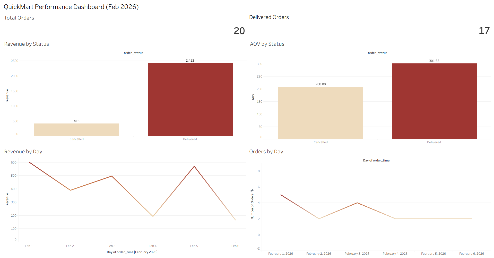

# quickmart-tableau-dashboard
Practicing Tableau dashboard built on a Mini QuickMart dataset

# QuickMart Tableau Dashboard

## Objective
Build a quick performance dashboard for an Instamart-like dataset (QuickMart).

## Tools
- Tableau Public
- CSV export from SQL dataset

## Files
- `QuickMart_Tableau_Dashboard.twbx` → packaged workbook (opens directly in Tableau)
- `dashboard.png` → dashboard preview screenshot

## Dashboard Preview

